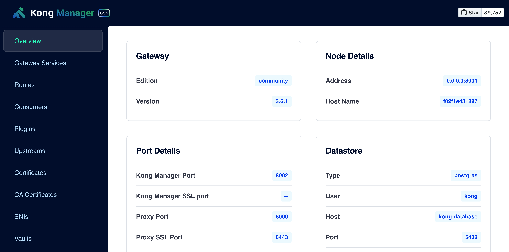

# Kong Docker deployment

Kong API Gateway deployment with Docker Compose - The most popular open-source API Gateway built for multi-cloud and hybrid architectures.

## Overview

Kong serves as a scalable, open-source API Gateway that sits in front of your services. It offers powerful features including:

- Authentication
- Rate Limiting
- Traffic Control
- Analytics
- Plugin Extensibility
- Load Balancing
- Health Checks
- API Transformations
- AI Gateway capabilities (3.9+)


*Kong Docker deployment architecture overview*

## Status

This deployment is production ready.

## Versions

| Component | Version |
|-----------|---------|
| Kong Gateway | 3.9 |
| PostgreSQL | 17-alpine |

## Quick Start

```bash
cp default.env .env
./setup.sh
```

This will execute all the necessary steps (database setup, migrations, and Kong startup) automatically.

## Manual Deployment

```bash
docker-compose up -d kong-database    # Start database
docker-compose run --rm kong-migrations  # Run migrations
docker-compose up -d kong              # Start Kong
```

**Endpoints after startup:**

| Service | URL |
|---------|-----|
| Kong Proxy | http://localhost:8000 |
| Kong Proxy SSL | https://localhost:8443 |
| Kong Admin API | http://localhost:8001 |
| Kong Admin API SSL | https://localhost:8444 |
| Kong Manager | http://localhost:8002 |
| Kong Manager SSL | https://localhost:8445 |

## Configuration

Copy `default.env` to `.env` and customize:

```bash
cp default.env .env
```

| Variable | Default |
|----------|---------|
| `KONG_VERSION` | 3.9 |
| `KONG_PG_DATABASE` | kong |
| `KONG_PG_USER` | kong |
| `KONG_PG_PASSWORD` | kong |

## Architecture

```
kong-database (PostgreSQL 17)
       ↓
kong-migrations (one-shot bootstrap)
       ↓
kong (Gateway 3.9)
```

Docker's `depends_on` with health check conditions ensures proper startup order:
- `kong-database` starts first with health check
- `kong-migrations` waits for database to be healthy
- `kong` waits for migrations to complete successfully

## Health Checks

```bash
curl http://localhost:8001/status
docker-compose ps
```

## Upgrading Kong

> **WARNING**: This may require downtime.

1. Update `KONG_VERSION` in `.env`
2. Run migrations:
   ```bash
   docker-compose run --rm kong kong migrations up --vv
   docker-compose run --rm kong kong migrations finish --vv
   ```
3. Restart Kong:
   ```bash
   docker-compose up -d kong
   ```

## Backup & Recovery

```bash
docker exec kong-database pg_dump -U kong kong > kong_backup.sql
```

## Security Considerations

- Change default passwords in production
- Use SSL/TLS for all external connections
- Restrict Admin API access (8001/8444) to trusted networks
- Kong runs with read-only filesystem and `no-new-privileges`

## 🏢 RACKSYNC CO., LTD.

RACKSYNC Co., Ltd. specializes in automation and smart solutions. We provide comprehensive consulting services and technical implementation for both residential and commercial projects.

📍 Suratthani, Thailand 84000
📧 devops@racksync.com
📞 +66 85 880 8885

[](https://discord.gg/Wc5CwnWkp4)
[](https://github.com/racksync)
